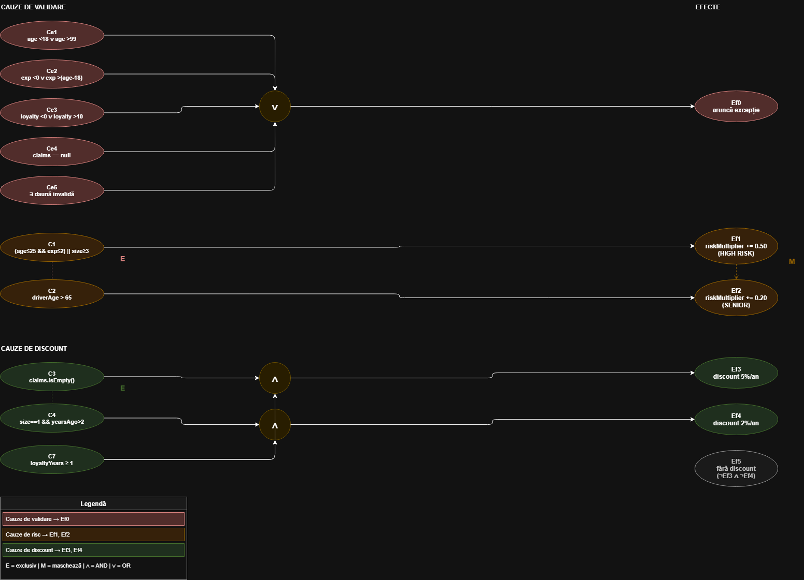
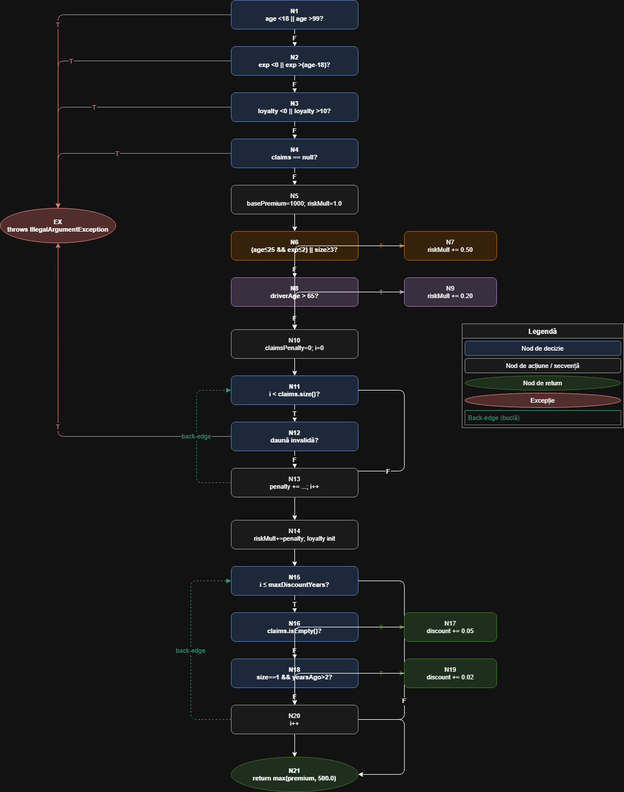
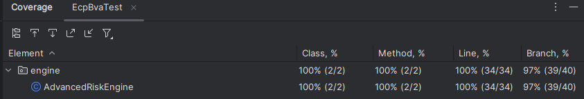
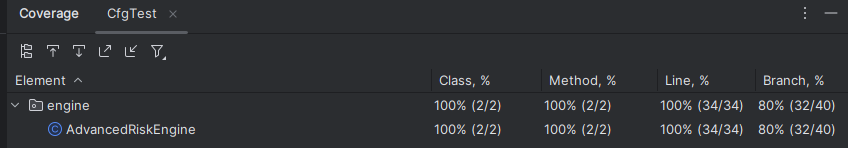
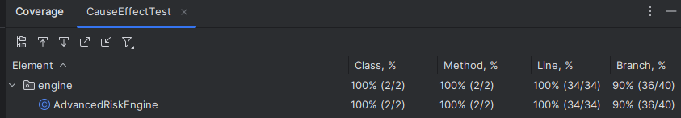
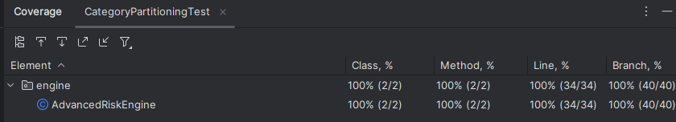
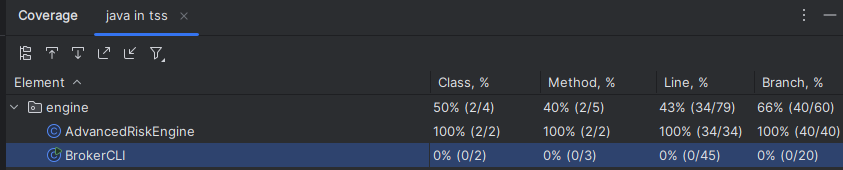
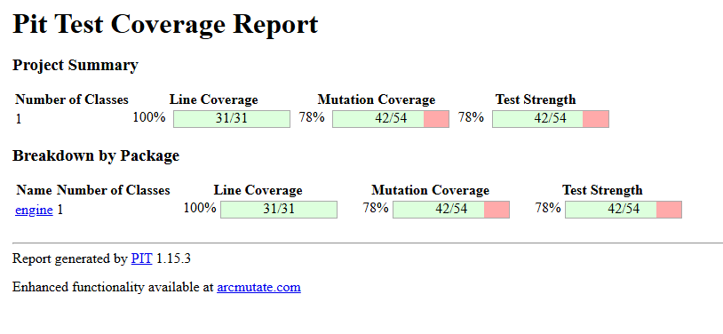
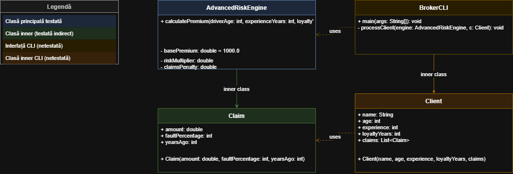

# Testare unitară în Java — AdvancedRiskEngine

## 1. Introducere

### 1.1 Descrierea proiectului

Acest proiect implementează și testează un motor de calcul al primei
de asigurare auto — `AdvancedRiskEngine` — folosind tehnici sistematice
de testare unitară în Java cu JUnit 5.

Proiect realizat de: Popa Robert Daniel și Sofronea Georgian, grupa 463.

### 1.2 Specificația sistemului

Metoda `calculatePremium(driverAge, experienceYears, loyaltyYears, claims)`
calculează prima de asigurare auto pornind de la o bază de 1000 RON,
ajustată prin trei mecanisme independente:

**Profilul de risc al șoferului:**
- RISC ÎNALT (+50%): șofer tânăr (≤25 ani ȘI experiență ≤2 ani)
  SAU istoric prost (≥3 daune)
  - RISC MEDIU (+20%): șofer senior (>65 ani)
  - RISC NORMAL: orice altceva

**Penalizarea din daune:**
Fiecare daună contribuie proporțional cu gravitatea, vina procentuală
și un factor de timp (time decay curve) — daunele vechi de 5+ ani
nu mai influențează prima.

**Reducerea de loialitate:**
- Fără daune: -5% per an de loialitate (maxim 5 ani = -25%)
  - Exact o daună veche (>2 ani): -2% per an de loialitate
  - Cu daune recente: 0%

**Prima finală:** `max(rezultat_calculat, 500 RON)`

### 1.3 Obiectivele testării

Proiectul ilustrează aplicarea tuturor strategiilor de generare a
testelor prezentate la curs, pe un exemplu propriu creat de echipă:

- Partiționare de echivalență (EPC) și analiza valorilor de frontieră (BVA)
  - Partiționarea în categorii (Category Partitioning)
  - Metoda grafului cauză-efect (Cause-Effect Graphing)
  - Testarea circuitelor independente (Basis Path Testing / CFG)
  - Analiza mutanților (Mutation Testing cu PIT)
  - Comparație cu teste generate automat de AI (Gemini)

## 2. Configurație

### 2.1 Configurație software

- **Java:** 21
  - **Build tool:** Maven
  - **IDE:** IntelliJ IDEA 2025.1.1
  - **Sistem de operare:** Windows
  - **Mașină virtuală:** nu s-a utilizat

### 2.2 Dependențe și versiuni tool-uri

- **JUnit Jupiter:** 5.10.2
  - **JUnit Platform Suite:** 1.10.2
  - **Maven Surefire Plugin:** 3.2.5
  - **JaCoCo:** 0.8.11
  - **PIT (pitest-maven):** 1.15.3
  - **pitest-junit5-plugin:** 1.2.1

### 2.3 Structura proiectului

    tss/
    ├── src/
    │   ├── main/
    │   │   └── java/
    │   │       └── engine/
    │   │           ├── AdvancedRiskEngine.java  ← clasa testată
    │   │           └── BrokerCLI.java
    │   └── test/
    │       └── java/
    │           ├── ecpbva/
    │           │   └── EcpBvaTest.java
    │           ├── category/
    │           │   └── CategoryPartitioningTest.java
    │           ├── causeeffect/
    │           │   └── CauseEffectTest.java
    │           └── cfg/
    │               └── CfgTest.java
    ├── pom.xml
    └── README.md

### 2.4 Comenzi utile

**Rulare teste:**
```bash
mvn test
```

**Generare raport JaCoCo:**
```bash
mvn test jacoco:report
```

Raportul se găsește în `target/site/jacoco/index.html`.

**Generare raport PIT:**
```bash
mvn test-compile org.pitest:pitest-maven:mutationCoverage
```

Raportul se găsește în `target/pit-reports/index.html`.

## 3. Clasa testată — AdvancedRiskEngine

### 3.1 Descriere generală

Proiectul conține două clase în pachetul `engine`:

- **`AdvancedRiskEngine`** — motorul de calcul al primei de asigurare, clasa principală testată
  - **`BrokerCLI`** — interfață de tip terminal (CLI) care permite unui utilizator să selecteze un client din bază și să vizualizeze prima calculată de `AdvancedRiskEngine`. Nu face parte din suita de teste.

### 3.2 Metoda testată

```java
public double calculatePremium(int driverAge, int experienceYears, 
                               int loyaltyYears, List<Claim> claims)
```

### 3.3 Parametrii de intrare și domeniile valide

- **`driverAge`** — vârsta șoferului: domeniu valid `[18, 99]`
  - **`experienceYears`** — ani de experiență la volan: domeniu valid `[0, driverAge - 18]`
  - **`loyaltyYears`** — ani de loialitate față de asigurător: domeniu valid `[0, 10]`
  - **`claims`** — lista de daune anterioare: nu poate fi `null`

Fiecare obiect `Claim` conține:
- **`amount`** — suma daunei: `≥ 0`
  - **`faultPercentage`** — procentul de vină: `[0, 100]`
  - **`yearsAgo`** — vechimea daunei în ani: `≥ 0`

### 3.4 Logica de calcul

Calculul se desfășoară în trei etape independente, aplicate peste prima de bază de **1000 RON**:

**Etapa 1 — Profilul de risc (`riskMultiplier`):**
- `+50%` dacă șoferul e tânăr (`driverAge ≤ 25 ȘI experienceYears ≤ 2`) SAU are `≥ 3` daune
  - `+20%` dacă șoferul e senior (`driverAge > 65`)
  - Cele două condiții sunt în `else if` — nu se cumulează

**Etapa 2 — Penalizarea din daune (`claimsPenalty`):**

Pentru fiecare daună din listă:
```
timeDecayCurve = Math.max(0, 5 - yearsAgo) / 5.0
severityPoints = (amount * faultPercentage / 100) / 1000
claimsPenalty += severityPoints * timeDecayCurve * 0.01
```
Daunele cu `yearsAgo ≥ 5` au `timeDecayCurve = 0` și nu influențează prima.

**Etapa 3 — Reducerea de loialitate (`loyaltyDiscount`):**
- Fără daune: `-5%` per an de loialitate
  - Exact o daună cu `yearsAgo > 2`: `-2%` per an de loialitate
  - Orice altă situație: `0%`
  - Plafonat la maximum `5 ani` de discount (`Math.min(loyaltyYears, 5)`)

**Prima finală:**
```
finalPremium = basePremium * (riskMultiplier - loyaltyDiscount)
return Math.max(finalPremium, 500.0)
```

### 3.5 Excepții aruncate

Metoda aruncă `IllegalArgumentException` pentru:
- `driverAge < 18` sau `driverAge > 99`
  - `experienceYears < 0` sau `experienceYears > driverAge - 18`
  - `loyaltyYears < 0` sau `loyaltyYears > 10`
  - `claims == null`
  - Orice daună cu `faultPercentage < 0`, `faultPercentage > 100`, `yearsAgo < 0` sau `amount < 0`

## 4. Strategii de testare aplicate

### 4.1 Partiționare de echivalență (EPC) și analiza valorilor de frontieră (BVA)

#### Principiu

Partiționarea de echivalență grupează datele de intrare în clase care
declanșează același comportament al sistemului, reducând numărul de teste
necesare prin alegerea unui singur reprezentant din fiecare clasă. Analiza
valorilor de frontieră o completează testând exact limitele acestor clase,
deoarece la marginile intervalelor de date se produc cele mai frecvente
erori de programare.

#### Clasele de echivalență identificate

**`driverAge`** — 5 clase:

- `A_inv1`: `driverAge < 18` → excepție
  - `A_inv2`: `driverAge > 99` → excepție
  - `A1`: `[18, 25]` — șofer tânăr, risc crescut dacă și `experienceYears ≤ 2`
  - `A2`: `[26, 65]` — adult, risc normal
  - `A3`: `[66, 99]` — senior, `riskMultiplier += 0.20`

Frontiere BVA: `17 | 18`, `25 | 26`, `65 | 66`, `99 | 100`

**`experienceYears`** — 4 clase:

- `E_inv1`: `experienceYears < 0` → excepție
  - `E_inv2`: `experienceYears > driverAge - 18` → excepție
  - `E1`: `[0, 2]` — experiență mică, activează HIGH RISK dacă `driverAge ≤ 25`
  - `E2`: `[3, driverAge - 18]` — experiență suficientă

Frontiere BVA: `-1 | 0`, `2 | 3`, `max | max+1`

> **Observație:** `E1` vs `E2` diferențiază comportamentul **doar** când
> `driverAge ∈ A1`. Pentru `A2` și `A3`, condiția `driverAge ≤ 25` este
> deja falsă, deci experiența nu influențează niciun calcul.

**`loyaltyYears`** — 5 clase:

- `L_inv1`: `loyaltyYears < 0` → excepție
  - `L_inv2`: `loyaltyYears > 10` → excepție
  - `L0`: `0` — fără discount
  - `L1`: `[1, 5]` — discount activ
  - `L2`: `[6, 10]` — discount activ, plafonat la 5 ani

Frontiere BVA: `-1 | 0`, `0 | 1`, `5 | 6`, `10 | 11`

> **Observație:** `L1` și `L2` produc același efect deoarece
> `Math.min(loyaltyYears, 5)` face ca orice valoare `≥ 5` să fie
> echivalentă cu `5` în calcul. Reprezentantul ales pentru ambele clase
> este `loyalty = 5`.

**`claims.size()`** — 6 clase:

- `C_null`: `claims == null` → excepție
  - `C0`: `[]` — fără daune, discount maxim posibil
  - `C1rec`: `size = 1, yearsAgo ≤ 2` — daună recentă, fără discount loyalty
  - `C1vec`: `size = 1, yearsAgo > 2` — daună veche, discount loyalty 2%/an
  - `C2`: `size = 2` — fără discount loyalty
  - `C3`: `size ≥ 3` — declanșează `riskMultiplier += 0.50`

Frontiere BVA: `null | 0`, `yearsAgo: 2 | 3`, `1 | 2`, `2 | 3`

> **Observație critică:** `C1` este descompusă în `C1rec` și `C1vec` pe
> baza condiției din cod:
> ```java
> } else if (claims.size() == 1 && claims.get(0).yearsAgo > 2) {
>     loyaltyDiscount += 0.02;
> }
> ```
> Fără acest split, ramura de discount redus nu ar fi acoperită de niciun test.

**Atribute per obiect `Claim`:**

`claim.amount` — 2 clase:
- `amount < 0` → excepție; frontieră BVA: `-1 | 0`
  - `amount ≥ 0` — valid

`claim.faultPercentage` — 3 clase:
- `faultPercentage < 0` → excepție; frontieră BVA: `-1 | 0`
  - `[0, 100]` — valid; frontiere BVA: `0`, `100`
  - `faultPercentage > 100` → excepție; frontieră BVA: `100 | 101`

`claim.yearsAgo` — 4 clase:
- `yearsAgo < 0` → excepție; frontieră BVA: `-1 | 0`
  - `[0, 2]` — recent, fără discount loyalty, decay mare
  - `[3, 4]` — veche, discount loyalty 2%/an, decay parțial
  - `≥ 5` — decay = 0, dauna nu mai influențează prima; frontieră BVA: `4 | 5`

#### Reducerea dimensionalității

**Pasul 1 — EPC pur (83 teste):**

```
3 (driverAge) × 2 (experienceYears) × 3 (loyaltyYears) × 4 (claims)
= 72 valide + 11 invalide = 83 teste
```

**Pasul 2 — Constrângerea de experiență (59 teste):**

`E1` vs `E2` diferențiază comportamentul doar pentru `A1`. Pentru `A2`
și `A3`, experiența nu contează — cele două clase se unesc:

```
A1 (tânăr):  2(exp) × 2(loyalty) × 4(claims) = 16
A2 (adult):  1      × 2(loyalty) × 4(claims) =  8
A3 (senior): 1      × 2(loyalty) × 4(claims) =  8
Subtotal: 32 valide

La cele 32, adăugăm grupul Tânăr+ExpMare ca grup separat de confirmare
a constrângerii (exp nu contează pentru A2 și A3, dar contează pentru A1):

Tânăr+ExpMare: 1 × 2(loyalty) × 4(claims) = 16
Total: 32 + 16 = 48 valide

Constrângerea `L1 ≡ L2` (discount identic prin `Math.min(loyaltyYears, 5)`)
reduce loyalty de la 3 clase la 2, deci am aplicat-o deja în calculul de mai sus.
```
```
48 valide + 11 invalide = 59 teste EPC reduse
```

**Pasul 3 — BVA (33 teste):**

BVA nu mai face produs cartezian — testează fiecare parametru la
frontierele lui cu ceilalți parametri fixați la un reprezentant neutru.
Frontiera critică `yearsAgo = 2 | 3` acoperă simultan două logici
distincte din cod: curba de decay și condiția de discount loyalty.

```
20 valide + 12 invalide (BVA descompune Ce5 în 4 sub-cazuri) + 1 test podea
= 33 teste totale
```

#### Fișier de teste

`src/test/java/ecpbva/EcpBvaTest.java` — 33 teste organizate în clase
`@Nested` per parametru testat.

### 4.2 Partiționarea în categorii (Category Partitioning)

#### Principiu

Partiționarea în categorii este o metodă sistematică de testare
funcțională care identifică parametrii de intrare și îi împarte în
categorii distincte pe baza comportamentului specificat. Puterea metodei
constă în combinarea structurată a categoriilor folosind constrângeri
logice (`[if]`) pentru a elimina combinațiile imposibile sau redundante.

#### Pasul 1 — Unitate funcțională

O singură unitate testabilă: `calculatePremium(driverAge, experienceYears, loyaltyYears, claims)`

#### Pasul 2 — Parametrii identificați

`driverAge`, `experienceYears`, `loyaltyYears`, `claims`,  
și per daună: `claim.amount`, `claim.faultPercentage`, `claim.yearsAgo`

#### Pasul 3 — Categoriile identificate

- **`driverAge`**: dacă se află în intervalul valid și în ce grup de risc
  - **`experienceYears`**: dacă este valid și dacă influențează condiția HIGH RISK
  - **`loyaltyYears`**: dacă este valid și ce tip de discount generează
  - **`claims`**: dacă lista este validă, câte daune conține și dacă sunt recente sau vechi
  - **`claim.faultPercentage`**: dacă procentul de vină este în intervalul valid `[0, 100]`
  - **`claim.amount`**: dacă suma daunei este validă (`≥ 0`)
  - **`claim.yearsAgo`**: dacă vechimea daunei este validă și ce efect are asupra penalizării și discountului de loialitate

#### Pasul 4 — Alternativele per categorie

**`driverAge`**
```
1) {d | d < 18}
2) {d | d > 99}
3) 18..25                [ok, tânăr]
4) 26..65                [ok, adult]
5) 66..99                [ok, senior]
```

**`experienceYears`**
```
1) {e | e < 0}
2) {e | e > driverAge − 18}
3) 0..2                  [ok, exp_mică]  [if ok and tânăr]
4) 3..(driverAge − 18)   [ok, exp_mare]  [if ok]
```

> Alternativa 3 are sens distinct doar când `driverAge ≤ 25` deoarece
> condiția din cod este `driverAge <= 25 && experienceYears <= 2`.

**`loyaltyYears`**
```
1) {l | l < 0}
2) {l | l > 10}
3) 0                     [ok, fără_discount]   [if ok]
4) 1..10                 [ok, discount]         [if ok]
```

> Alternativele pentru `[1,5]` și `[6,10]` sunt unite deoarece
> `Math.min(loyaltyYears, 5)` produce același discount pentru orice
> valoare `≥ 5`. Reprezentantul ales: `loyalty = 5`.

**`claims`**
```
1) null
2) []                              [ok, fără_daune]        [if ok]
3) {size=1, yearsAgo ≤ 2}         [ok, daună_recentă]     [if ok]
4) {size=1, yearsAgo > 2}         [ok, daună_veche]       [if ok]
5) {size=2}                        [ok, daune_multiple]    [if ok]
6) {size ≥ 3}                      [ok, HIGH_RISK_trigger] [if ok]
```

**`claim.faultPercentage`**
```
1) {f | f < 0}
2) {f | f > 100}
3) 0..100                [ok]    [if ok and size ≥ 1]
```

**`claim.amount`**
```
1) {a | a < 0}
2) {a | a ≥ 0}           [ok]    [if ok and size ≥ 1]
```

**`claim.yearsAgo`**
```
1) {y | y < 0}
2) 0..2    [ok, decay_mare, fără_discount_loyalty]     [if ok and size ≥ 1]
3) 3..4    [ok, decay_mediu, discount_loyalty_posibil] [if ok and size ≥ 1]
4) {y ≥ 5} [ok, decay_zero]                            [if ok and size ≥ 1]
```

#### Pasul 5 — Specificația de testare

Lista celor 7 categorii cu alternativele și condițiile `[if]` de mai sus
constituie specificația de testare.

#### Pasul 6 — Cazurile de testare

Fără constrângeri: `5 × 4 × 4 × 6 × 3 × 2 × 4 = 11.520 combinații`.

Aplicând constrângerile `[if]`, combinațiile imposibile sunt eliminate.
Rezultă **4 grupuri age×exp** × **2 loyalty** × **5 claims** = **40 valide**:

| Grup (age×exp) | Loyalty | Claims | Teste |
|---|---|---|---|
| Tânăr + exp_mică (22, exp=1) | L_fără (0), L_activ (5) | C0, C1rec, C1vec, C2, C3 | 10 |
| Tânăr + exp_mare (25, exp=5) | L_fără (0), L_activ (5) | C0, C1rec, C1vec, C2, C3 | 10 |
| Adult (40, exp=10) | L_fără (0), L_activ (5) | C0, C1rec, C1vec, C2, C3 | 10 |
| Senior (70, exp=5) | L_fără (0), L_activ (5) | C0, C1rec, C1vec, C2, C3 | 10 |

**Invalide: 11** — câte una per condiție de excepție din cod:

```
age < 18, age > 99, exp < 0, exp > max, loyalty < 0, loyalty > 10,
claims = null, faultPct < 0, faultPct > 101, yearsAgo < 0, amount < 0
```

**Total: 40 + 11 = 51 teste**

#### Pasul 7 — Date de test (exemple reprezentative)

```java
// Tânăr + exp_mică + fără loyalty + fără daune → HIGH RISK
calculatePremium(22, 1, 0, []) → 1500.0

// Tânăr + exp_mică + loyalty activ + daună veche → HIGH RISK + discount redus
calculatePremium(22, 1, 5, [Claim(1000, 100, 3)]) → 1404.0

// Senior + loyalty activ + fără daune → SENIOR + discount maxim
calculatePremium(70, 5, 5, []) → 950.0

// 3 daune → HIGH RISK indiferent de vârstă
calculatePremium(40, 10, 0, [c, c, c]) → 1524.0
```

> **Notă:** O categorie suplimentară poate fi considerată numărul de
> apariții ale lui `yearsAgo` cu valoarea exactă `≥ 5` în lista de daune
> (decay = 0 → dauna devine irelevantă pentru primă).

#### Fișier de teste

`src/test/java/category/CategoryPartitioningTest.java` — 51 teste
parametrizate cu `@ParameterizedTest` și `@MethodSource`.

### 4.3 Metoda grafului cauză-efect (Cause-Effect Graphing)

#### Principiu

Metoda grafului cauză-efect modelează vizual și matematic relațiile logice
(AND, OR, NOT) dintre condițiile de intrare ale sistemului (cauze) și
comportamentele rezultate (efecte). Această reprezentare este transformată
într-un tabel de decizie, permițând generarea unui set riguros de teste
care validează regulile complexe de business și exclude combinațiile
imposibile.

**Cauză** = orice condiție din specificație care poate afecta răspunsul
programului.  
**Efect** = răspunsul programului la o combinație de condiții de intrare.

#### Cauzele identificate

**Cauze de validare:**

```
Ce1: driverAge < 18 ∨ driverAge > 99
Ce2: experienceYears < 0 ∨ experienceYears > (driverAge - 18)
Ce3: loyaltyYears < 0 ∨ loyaltyYears > 10
Ce4: claims == null
Ce5: ∃ daună cu date invalide
```

Fiecare cauză de validare vine direct din pre-condițiile implicite ale
specificației — orice motor de calcul presupune că datele de intrare sunt
valide.

**Cauze de logică business:**

```
C1: (driverAge <= 25 && experienceYears <= 2) || claims.size() >= 3
C2: driverAge > 65
C3: claims.isEmpty()
C4: claims.size() == 1 && claims.get(0).yearsAgo > 2
C5: alte condiții pentru daune (¬C3 ∧ ¬C4)
```

Fiecare cauză de business vine direct din specificație:
- `C1` — din cerința *"RISC ÎNALT: șofer tânăr SAU istoric prost"*
  - `C2` — din cerința *"RISC MEDIU: șofer senior (>65 ani)"*
  - `C3` și `C4` — din cerința *"Fără daune: -5%" și "Exact o daună veche: -2%"*
  - `C5` — din cerința *"Cu daune recente: 0%"*

#### Efectele identificate

```
Ef0: aruncă IllegalArgumentException
Ef1: riskMultiplier += 0.50  (HIGH RISK)
Ef2: riskMultiplier += 0.20  (SENIOR)
Ef3: loyaltyDiscount = min(ly,5) × 0.05  (discount complet)
Ef4: loyaltyDiscount = min(ly,5) × 0.02  (discount redus)
Ef5: loyaltyDiscount = 0                  (fără discount, implicit)
```

Fiecare efect corespunde unei ramuri separate din cod:
- `Ef0` — cele 4 `throw`-uri din validări
  - `Ef1` — `riskMultiplier += 0.50` din primul `if`
  - `Ef2` — `riskMultiplier += 0.20` din `else if`
  - `Ef3` și `Ef4` — cele două ramuri din bucla `while`
  - `Ef5` — efectul implicit când niciuna din ramurile de discount nu e activă

#### Formulele booleene

```
Ef0 = Ce1 ∨ Ce2 ∨ Ce3 ∨ Ce4 ∨ Ce5
Ef1 = C1
Ef2 = C2          [mascat de Ef1 prin else-if]
Ef3 = C3 ∧ C7     [C7: loyaltyYears ≥ 1]
Ef4 = C4 ∧ C7
Ef5 = ¬Ef3 ∧ ¬Ef4
```

#### Constrângerile din graf

**Între cauze:**
- **E(C1, C2)** — exclusiv: `driverAge` nu poate fi simultan `≤ 25` și `> 65`
  - **E(C1_claims, C3, C4)** — exclusiv: `claims.size()` determină exact una din cele trei clase

**Între efecte:**
- **M(Ef1, Ef2)** — `Ef1` maschează `Ef2`: `else if` în cod face ca SENIOR să nu se aplice când HIGH RISK e activ

#### Graful cauză-efect



> Diagramă realizată cu diagrams.net

#### Tabelul de decizie

Din graf se identifică toate combinațiile de cauze care produc fiecare
efect. Coloanele rezultate sunt cazurile de testare.

**Cele 13 coloane de logică business** rezultă din combinarea regimurilor
de risc cu stările de discount:

**Regimuri de risc:**
- `R1`: Tânăr + exp_mică → `Ef1`
  - `R2`: Tânăr + exp_mare → fără efect risc
  - `R3`: Adult → fără efect risc
  - `R4`: Senior → `Ef2`
  - `C4 ≥ 3 daune` → `Ef1` (coloana 13, separată)

**Stări de discount:**
- `D1`: `claims.isEmpty() ∧ loyalty ≥ 1` → `Ef3`
  - `D2`: `1 daună veche ∧ loyalty ≥ 1` → `Ef4`
  - `D3`: altceva → `Ef5`

`R1-R4` × `D1-D3` = 12 coloane + 1 coloană pentru `C4` = **13 coloane business**

**Cele 5 coloane invalide** — câte una per cauză de validare `Ce1-Ce5`.

**Total: 13 + 5 = 18 coloane = 18 teste**

#### Verificarea constrângerilor

Noi verificăm explicit în `CauseEffectTest` că constrângerile din graf
sunt respectate în cod:

```java
// M(Ef1, Ef2): senior cu 3+ daune → Ef1 activ, Ef2 mascat
// riskMultiplier = 1.50, nu 1.70
calculatePremium(70, 1, 0, [c, c, c]) → 1500.0

// E(C4,C5,C6): 3 daune → discount imposibil chiar cu loyalty=5
calculatePremium(40, 10, 5, [c, c, c]) → 1500.0
```

#### Fișier de teste

`src/test/java/causeeffect/CauseEffectTest.java` — 24 teste organizate în:
- `CauzeInvalide` — 8 teste pentru `Ef0`
  - `tabelDeDecizie` — 13 teste parametrizate cu `@ParameterizedTest`
  - `VerificareConstrangeri` — 3 teste pentru constrângerile `E` și `M`

### 4.4 Testarea circuitelor independente (Basis Path Testing / CFG)

#### Principiu

Testarea circuitelor independente este o metodă de testare structurală —
datele de test sunt generate pe baza implementării codului, nu a
specificației. Codul este reprezentat ca un graf de flux de control (CFG),
iar complexitatea ciclomatică V(G) determină numărul minim de teste
necesare pentru a obține branch coverage complet.

#### Graful de flux de control (CFG)



> Diagramă realizată cu diagrams.net

Nodurile decizionale identificate:

```
N1:  driverAge < 18 || driverAge > 99
N2:  experienceYears < 0 || experienceYears > (driverAge-18)
N3:  loyaltyYears < 0 || loyaltyYears > 10
N4:  claims == null
N5:  (driverAge<=25 && experienceYears<=2) || claims.size()>=3
N6:  driverAge > 65
N7:  i < claims.size()                      [for condition]
N8:  c.faultPercentage < 0 || ...           [daună invalidă]
N9:  i <= maxDiscountYears                  [while condition]
N10: claims.isEmpty()
N11: claims.size()==1 && yearsAgo > 2
EX:  throws IllegalArgumentException
```

#### Calculul complexității ciclomatice

```
V(G) = e - n + 2
V(G) = 34 - 22 + 2 = 14
```

unde `n = 22` noduri și `e = 34` muchii.

V(G) = 14 este mai mare decât exemplul din curs (V=7 pentru `MyClass`)
deoarece `calculatePremium` are mai mulți predicați (11 vs ~6) și mai
multe puncte de ieșire (6 `throw`-uri + 1 `return` = 7 exits față de
1 în `MyClass`). Fiecare exit suplimentar față de unul adaugă 1 la V(G).

#### Cele 14 circuite independente

| # | Circuit | Cale |
|---|---|---|
| C1 | Baseline — niciun risc, nicio daună, nicio loialitate | N1F→N2F→N3F→N4F→N5→N6F→N8F→N10→N11F→N14→N15F→N21 |
| C2 | D1=T — vârstă invalidă | N1→EX |
| C3 | D2=T — experiență invalidă | N1F→N2→EX |
| C4 | D3=T — loialitate invalidă | →N3→EX |
| C5 | D4=T — claims null | →N4→EX |
| C6 | D5=T — HIGH RISK | N5→N7→... |
| C7 | D6=T — SENIOR | N5F→N6→... |
| C8 | D7=T, D8=F — for body, daună validă | N7→N8F→N7F→... |
| C9 | D8=T — daună invalidă în buclă | N7→N8→EX |
| C10 | D9=T, D10=T — while + isEmpty | N9→N10→... |
| C11 | D9=T, D10=F, D11=T — discount 2% | N9→N10F→N11→... |
| C12 | D9=T, D10=F, D11=F — fără discount | N9→N10F→N11F→... |
| C13 | Back-edge for — bucla for rulează ≥ 2× | N7→N8F→N7→... |
| C14 | Back-edge while — bucla while rulează ≥ 2× | N9→...→N9→... |

Circuitele C2–C5 acoperă punctele de ieșire timpurie (exception paths).
C6 și C7 acoperă ramurile `if-else if` de risc. C8–C9 acoperă ambele
ramuri ale for-body. C10–C12 acoperă toate combinațiile din while-body.
C13 și C14 acoperă back-edge-urile buclelor — esența testării structurale
a buclelor, distincte față de C8/C10 care testează intrarea în buclă.

> Un set de bază nu este unic — pot exista alte 14 circuite independente
> valide. Orice set de bază care acoperă toate muchiile este suficient
> pentru branch coverage complet.

#### Garanții ale metodei

| Tip coverage | Garantat de V(G)=14 circuite |
|---|---|
| Statement coverage | DA — 100% |
| Branch coverage | DA — 100% la nivel de decizie globală |
| Condition coverage | NU — necesită MC/DC |
| Mutation score | NU — depinde de valorile alese |

> **Observație:** JaCoCo măsoară branch coverage la nivel de
> sub-condiție individuală din `||` și `&&`, nu la nivel de decizie
> globală. De aceea branch coverage-ul raportat de JaCoCo pentru
> pachetul `cfg` este sub 100% chiar cu toate cele 14 circuite acoperite.

#### Teste BVA suplimentare pentru mutanți

Analiza raportului PIT a identificat 2 mutanți neechivalenți
supraviețuitori după rularea celor 14 circuite. Au fost adăugate 2 teste
BVA pentru a-i ucide:

**Mutanții de pe linia 29** (`ConditionalsBoundaryMutator`):
```java
// Original:
if ((driverAge <= 25 && experienceYears <= 2) || claims.size() >= 3)

// Mutant idx71: driverAge <= 25 → driverAge < 25
// Mutant idx74: experienceYears <= 2 → experienceYears < 2
```
Test killer: `age=25, exp=2` → `1500.0`  
Frontiera exactă `age=25` și `exp=2` face ca ambii mutanți să producă
`1000.0` în loc de `1500.0` → detectați.

**Mutantul de pe linia 56** (`ConditionalsBoundaryMutator`):
```java
// Original:
} else if (claims.size() == 1 && claims.get(0).yearsAgo > 2)

// Mutant idx240: yearsAgo > 2 → yearsAgo >= 2
```
Test killer: `yearsAgo=2, loyalty=1` → `1000.0`  
Cu mutantul activ, `yearsAgo=2` satisface `>= 2` și produce discount →
`980.0` ≠ `1000.0` → detectat.

#### Fișier de teste

`src/test/java/cfg/CfgTest.java` — 16 teste:
- 14 teste CFG (C1–C14), câte unul per circuit independent
  - 2 teste BVA suplimentare pentru uciderea mutanților neechivalenți

## 5. Rezultate

### 5.1 Rezultate JaCoCo (Code Coverage)

Rapoartele de acoperire sunt generate cu JaCoCo 0.8.11 și vizualizate
în IntelliJ IDEA. Toate măsurătorile se referă la clasa
`AdvancedRiskEngine` — clasa testată. `BrokerCLI` nu face parte din
suita de teste și nu este luată în calcul.

**Rezultate per pachet de teste:**

| Pachet | Class, % | Method, % | Line, % | Branch, % |
|---|---|---|---|---|
| `EcpBvaTest` | 100% (2/2) | 100% (2/2) | 100% (34/34) | 97% (39/40) |
| `CategoryPartitioningTest` | 100% (2/2) | 100% (2/2) | 100% (34/34) | 100% (40/40) |
| `CauseEffectTest` | 100% (2/2) | 100% (2/2) | 100% (34/34) | 90% (36/40) |
| `CfgTest` | 100% (2/2) | 100% (2/2) | 100% (34/34) | 80% (32/40) |

**Rezultate globale (toate pachetele împreună):**

`AdvancedRiskEngine`: 100% class, 100% method, 100% line, 100% branch (40/40)

> **Observație:** Rulând toate pachetele de teste împreună se obține
> 100% branch coverage complet — fiecare ramură din `AdvancedRiskEngine`
> este acoperită de cel puțin un test din cele 4 pachete combinate.

**Interpretarea branch coverage per pachet:**

`CategoryPartitioningTest` obține 100% branch coverage deoarece
partiționarea în categorii acoperă sistematic toate combinațiile de
clase, inclusiv toate ramurile din condițiile compuse cu `||`.

`EcpBvaTest` obține 97% (39/40) — o singură ramură neacoperită,
explicabilă prin faptul că BVA testează frontierele parametrilor
individual, nu toate combinațiile de sub-condiții din `||`.

`CauseEffectTest` obține 90% (36/40) — ramurile neacoperite corespund
sub-condițiilor din `||` care nu sunt testate independent, deoarece
metoda cauză-efect operează la nivel de decizie globală, nu de condiție
individuală.

`CfgTest` obține 80% (32/40) — expected pentru CFG clasic. JaCoCo
măsoară branch coverage la nivel de sub-condiție individuală din `||`
și `&&`, în timp ce CFG garantează branch coverage la nivel de decizie
globală (True/False per `if`). Acoperirea completă a sub-condițiilor
necesită MC/DC testing — metodă distinctă de CFG.

**Capturi de ecran:**







---

### 5.2 Rezultate PIT (Mutation Testing)

PIT 1.15.3 a fost configurat să ruleze mutanții pe clasa
`AdvancedRiskEngine` folosind testele din pachetul `cfg.*`. Această
alegere este deliberată — mutation testing-ul este aplicat specific pe
pachetul CFG pentru a demonstra că circuitele independente ucid mutanți
și pentru a identifica mutanții neechivalenți supraviețuitori care
necesită teste BVA suplimentare.

**Rezultate generale:**

- Mutanți generați: **57**
  - Mutanți uciși: **47**
  - Mutanți supraviețuitori: **10**
  - Mutation score: **82.5%**

**Tipuri de mutatori folosiți (`DEFAULTS`):**

- `ConditionalsBoundaryMutator` — schimbă `<=` în `<`, `>=` în `>` etc.
  - `MathMutator` — înlocuiește operatori aritmetici (`+` cu `-`, `*` cu `/`)
  - `RemoveConditionalMutator_EQUAL_ELSE` — elimină condiții de egalitate
  - `RemoveConditionalMutator_ORDER_ELSE` — elimină condiții de comparație
  - `PrimitiveReturnsMutator` — înlocuiește valoarea returnată cu `0.0`

**Mutanții supraviețuitori și explicația lor:**

Toți cei 10 mutanți supraviețuitori sunt pe liniile 21, 22, 23, 29,
31, 38, 42 și corespund sub-condițiilor individuale din expresii
compuse cu `||` și `&&`. Aceștia supraviețuiesc din același motiv
pentru care branch coverage-ul CFG e 80% — CFG nu testează fiecare
sub-condiție individual. De exemplu:

```java
// Linia 21 — mutant supraviețuitor idx8:
// Original:  driverAge < 18 || driverAge > 99
// Mutant:    driverAge < 18 || driverAge >= 99
// Supraviețuiește deoarece niciun test nu folosește exact age=99
// cu prima sub-condiție falsă în mod izolat.
```

```java
// Linia 42 — mutant supraviețuitor idx155:
// Original:  Math.max(0, 5 - c.yearsAgo) / 5.0
// Mutant:    Math.max(0, 5 + c.yearsAgo) / 5.0
// Supraviețuiește deoarece testele CFG nu verifică
// valoarea exactă a timeDecayCurve pentru toate valorile yearsAgo.
```

**Mutanții neechivalenți uciși prin teste BVA suplimentare:**

Analiza raportului PIT a identificat 3 mutanți neechivalenți
supraviețuitori în varianta fără testele BVA. Au fost adăugate 2 teste
BVA care ucid toți 3:

`killMutant_L29_boundaryHighRisk` (`age=25, exp=2`) ucide:
- idx71: `driverAge <= 25` → `driverAge < 25` — produce `1000.0` în loc de `1500.0`
  - idx74: `experienceYears <= 2` → `experienceYears < 2` — produce `1000.0` în loc de `1500.0`

`killMutant_L56_boundaryYearsAgo` (`yearsAgo=2, loyalty=1`) ucide:
- idx240: `yearsAgo > 2` → `yearsAgo >= 2` — produce `980.0` în loc de `1000.0`

**Captură de ecran:**



## 6. Comparație cu testele generate de AI (Gemini)

### 6.1 Metodologie

Pentru fiecare metodă de testare aplicată, am generat un set echivalent
de teste folosind Gemini, furnizând codul clasei `AdvancedRiskEngine`
și cerând aplicarea metodei respective. Testele generate au fost rulate
pe aceeași clasă și comparate din perspectiva corectitudinii, acoperirii
și înțelegerii metodei aplicate.

**Prompt utilizat (același pentru toate metodele, adaptat per metodă):**

> "Generează teste JUnit 5 pentru clasa AdvancedRiskEngine folosind
> [metoda]. [cod clasă]"

**Captură de ecran necesară:** fereastra Gemini cu promptul și răspunsul
generat pentru fiecare metodă.

---

### 6.2 EPC + BVA — testele noastre (33) vs. Gemini (30)

**Diferența principală — split-ul yearsAgo=2 vs yearsAgo=3:**

Noi testăm explicit frontiera `yearsAgo=2` și `yearsAgo=3` ca două
teste separate, deoarece această frontieră apare în două logici distincte
din cod simultan: curba de decay și condiția de discount loyalty:

```java
} else if (claims.size() == 1 && claims.get(0).yearsAgo > 2) {
    loyaltyDiscount += 0.02;
}
```

Gemini nu are niciun test care să verifice interacțiunea dintre
`yearsAgo` și discountul de loialitate — testele TC27-TC30 testează
penalitatea per daună izolat, fără loyalty activ.

**Diferența 2 — frontiera loyalty=1:**

Noi testăm `loyalty=1` ca frontieră inferioară a discountului activ
→ `premium=950.0`. Gemini trece direct de la `loyalty=0` la `loyalty=5`.

**Diferența 3 — podea 500:**

Noi testăm explicit că prima nu coboară sub 500. Gemini nu are niciun
test pentru această constrângere.

**Ce are Gemini în plus:**

Gemini testează `amount=0` ca frontieră inferioară validă a sumei
daunei izolat — noi testăm această valoare implicit în alte teste dar
nu o izolăm explicit.

**Capturi de ecran necesare:**
- Rularea testelor Gemini în IntelliJ — toate verzi
  - Raport JaCoCo testele Gemini vs. raport JaCoCo testele noastre —
    linia 56 neacoperită la Gemini, acoperită la noi

---

### 6.3 Category Partitioning — testele noastre (51) vs. Gemini (71)

**Diferența principală — `assertDoesNotThrow` vs. `assertEquals`:**

Gemini verifică doar că nu se aruncă excepție pentru toate testele
valide:

```java
assertDoesNotThrow(() -> engine.calculatePremium(age, experience, loyalty, claims));
```

Noi verificăm valoarea exactă a primei calculate pentru fiecare
combinație:

```java
assertEquals(1508.0, engine.calculatePremium(22, 1, 5, oR), 0.01);
```

Un test care face doar `assertDoesNotThrow` nu detectează erori de
calcul. Dacă `riskMultiplier += 0.50` ar fi scris greșit ca
`riskMultiplier -= 0.50`, testele Gemini ar trece în continuare verde.

**Diferența 2 — reprezentanți incorecți pentru daune vechi:**

Gemini folosește `yearsAgo=7, 8, 9, 10` ca reprezentanți pentru
daune vechi — toate produc `timeDecayCurve = 0`, deci sunt echivalente
cu daune inexistente. Noi folosim `yearsAgo=3` care produce decay
parțial și activează discountul de loialitate.

**Diferența 3 — redundanță în combo-urile age×exp:**

Gemini separă Adult+ExpMică de Adult+ExpMare și Senior+ExpMică de
Senior+ExpMare fără să observe că pentru Adult și Senior condiția
`driverAge <= 25` e deja falsă — experiența nu influențează niciun
calcul. Noi reducem la 4 combo-uri justificate matematic.

**Captură de ecran necesară:**
- Bug deliberat în cod (`+= 0.50` → `-= 0.50`) → testele Gemini
  trec verde, testele noastre pică

---

### 6.4 Cauză-Efect — testele noastre (24) vs. Gemini (15)

**Diferența principală — tabelul de decizie cu 13 coloane:**

Noi implementăm explicit toate cele 13 coloane din tabelul de decizie
generat din graful cauză-efect, acoperind toate combinațiile dintre
regimurile de risc și stările de discount. Gemini nu construiește
niciun tabel de decizie — testele sunt ad-hoc, fără o structură
sistematică.

**Diferența 2 — verificarea constrângerilor E și M:**

Noi verificăm explicit că:
- `M(Ef1, Ef2)`: senior cu 3+ daune → `1500.0` nu `1700.0`
  - `E(C4,C5,C6)`: 3 daune cu loyalty=5 → discount imposibil → `1500.0`

Gemini nu verifică nicio constrângere din graf.

**Diferența 3 — valori așteptate eronate la Gemini:**

Gemini produce două valori așteptate greșite în varianta anterioară
a testelor — `assertEquals(500.0, premium)` pentru scenarii care
produc `1500.0`. Aceasta demonstrează că Gemini nu a înțeles logica
de calcul a primei.

**Ce are Gemini în plus:**

Testele R5, R6, R7 ale Gemini verifică scenarii cu penalizare per
daună combinată cu discount de loialitate parțial, cu calcule explicite
în comentarii — scenarii pe care noi nu le acoperim explicit în
`CauseEffectTest`.

**Captură de ecran necesară:**
- Rularea testelor Gemini — testele cu valori greșite pică cu roșu
  - Rularea testelor noastre — toate verzi

---

### 6.5 CFG — testele noastre (16) vs. Gemini (21)

**Diferența principală — Gemini nu aplică metoda CFG:**

Noi generăm teste pornind de la V(G)=14 circuite independente
identificate din graful de flux de control, cu fiecare test etichetat
explicit cu nodul de decizie acoperit și calea traversată. Gemini
generează teste funcționale ad-hoc fără nicio referință la circuite,
noduri, back-edges sau complexitate ciclomatică.

**Diferența 2 — back-edges neacoperite la Gemini:**

Noi avem teste dedicate pentru ambele back-edges:

```java
// C13 — back-edge for: forțează 2 iterații în bucla for
void c13_backEdgeFor_doiClaimsValizi()

// C14 — back-edge while: forțează 2 iterații în bucla while
void c14_backEdgeWhile_douaIteratii()
```

Gemini nu forțează explicit mai mult de o iterație într-o buclă.

**Diferența 3 — granularitate V(G):**

Gemini calculează V(G)=21 folosind formula `V(G) = P + 1` unde P =
numărul de condiții booleene individuale, numărând fiecare operand din
`||` și `&&` ca predicat separat. Noi calculăm V(G)=14 folosind formula
McCabe clasică `V(G) = e - n + 2` pe graful de flux de control, unde
un `if` compus e un singur nod de decizie.

Ambele formule sunt corecte — diferența e de granularitate. V(G)=21
al Gemini e mai aproape de **condition coverage**, în timp ce V(G)=14
al nostru garantează **branch coverage** la nivel de decizie globală.
Tocmai de aceea testele Gemini produc un branch coverage mai mare în
JaCoCo — JaCoCo măsoară la nivel de sub-condiție, ca Gemini.

**Diferența 4 — teste motivate de raportul PIT:**

Noi adăugăm 2 teste BVA suplimentare motivate explicit de analiza
raportului PIT. Gemini nu are niciun test motivat de mutation testing.

**Captură de ecran necesară:**
- Raport JaCoCo testele Gemini vs. raport JaCoCo testele noastre —
  branch coverage % diferit

---

### 6.6 Interpretare finală

Gemini generează teste funcționale corecte sintactic, dar cu limitări
sistematice în aplicarea metodelor formale de testare:

În **EPC+BVA**, Gemini ratează frontierele care implică interacțiuni
între parametri — în special `yearsAgo=2|3` care acoperă simultan
două logici din cod.

În **Category Partitioning**, Gemini folosește `assertDoesNotThrow`
pentru testele valide, eliminând orice putere de detecție a erorilor
de calcul — testele trec chiar și cu bug-uri deliberate în cod.

În **Cauză-Efect**, Gemini nu construiește tabelul de decizie din graf
și nu verifică constrângerile E și M — testele sunt funcționale dar
nu aplică metoda cerută.

În **CFG**, Gemini aplică o variantă de condition coverage (V(G)=21)
în loc de basis path testing clasic (V(G)=14), generând mai multe teste
dar fără back-edges și fără motivare din raportul de mutanți.

Concluzia generală este că Gemini poate fi util ca punct de plecare
pentru generarea rapidă de teste funcționale de bază, dar nu înlocuiește
aplicarea sistematică a metodelor formale de testare — care necesită
înțelegerea structurii interne a codului, a relațiilor dintre parametri
și a instrumentelor de analiză (JaCoCo, PIT).

## 7. Diagrame

Toate diagramele sunt realizate cu [diagrams.net](https://app.diagrams.net)
și se găsesc în folderul `diagrams/` din repository.

### 7.1 Diagrama claselor

Ilustrează structura claselor din pachetul `engine` și relațiile dintre ele.



- `AdvancedRiskEngine` — clasa principală testată (albastru)
  - `Claim` — inner class testată indirect (verde)
  - `BrokerCLI` — interfață CLI netestată (galben)
  - `Client` — inner class a `BrokerCLI`, netestată (portocaliu)

### 7.2 Graful cauză-efect

Ilustrează relațiile logice dintre cauzele de intrare și efectele
produse de `calculatePremium`, cu operatorii ∧ și ∨ și constrângerile
E și M.


### 7.3 Graful de flux de control (CFG)

Ilustrează structura de control a metodei `calculatePremium` cu toate
nodurile de decizie (N1-N21), back-edge-urile buclelor `for` și `while`
și nodul de excepție EX.


> Fișierele sursă `.drawio` se găsesc în `diagrams/` și pot fi editate
> direct în diagrams.net.

## 8. Cum rulezi proiectul

### 8.1 Prerequisite

- Java 21 instalat și configurat în `PATH`
  - Maven instalat și configurat în `PATH`
  - IntelliJ IDEA (opțional, pentru vizualizarea rapoartelor de coverage)

Verificare:
```bash
java -version
mvn -version
```

### 8.2 Clonare repository

```bash
git clone <link-repository>
cd tss
```

### 8.3 Rulare teste

**Toate pachetele împreună:**
```bash
mvn test
```

**Un singur pachet:**
```bash
mvn test -Dtest="EcpBvaTest"
mvn test -Dtest="CategoryPartitioningTest"
mvn test -Dtest="CauseEffectTest"
mvn test -Dtest="CfgTest"
```

### 8.4 Generare raport JaCoCo

```bash
mvn test jacoco:report
```

Raportul HTML se găsește în:
```
target/site/jacoco/index.html
```

Deschide fișierul în browser pentru a vizualiza coverage-ul per clasă,
metodă, linie și ramură. Pentru a vedea coverage-ul per pachet de teste,
rulează mai întâi doar pachetul dorit (`mvn test -Dtest="..."`) și apoi
generează raportul.

### 8.5 Generare raport PIT

```bash
mvn test-compile org.pitest:pitest-maven:mutationCoverage
```

Raportul HTML se găsește în:
```
target/pit-reports/index.html
```

> **Notă:** PIT este configurat în `pom.xml` să ruleze mutanții pe clasa
> `AdvancedRiskEngine` folosind testele din pachetul `cfg.*`. Pentru a
> schimba pachetul țintă, modifică `<targetTests>` în `pom.xml`.

### 8.6 Rulare aplicație demo (BrokerCLI)

```bash
mvn compile exec:java -Dexec.mainClass="engine.BrokerCLI"
```

Sau direct din IntelliJ IDEA — click dreapta pe `BrokerCLI.java` →
`Run 'BrokerCLI.main()'`.

### 8.7 Interpretarea rezultatelor

**JaCoCo:**
- Verde — linie/ramură acoperită
  - Galben — ramură parțial acoperită (una din sub-condiții netestată)
  - Roșu — linie/ramură neacoperită

**PIT:**
- `KILLED` — mutantul a fost detectat de cel puțin un test
  - `SURVIVED` — mutantul nu a fost detectat de niciun test
  - `NO_COVERAGE` — niciun test nu acoperă linia mutată

Un mutation score de 100% înseamnă că fiecare modificare introdusă
de PIT în cod a fost detectată de suita de teste.

## 9. Referințe bibliografice

### Documentații oficiale tool-uri

[1] JUnit Team, *JUnit 5 User Guide*, https://junit.org/junit5/docs/current/user-guide/,
Data ultimei accesări: aprilie 2025.

[2] JaCoCo Team, *JaCoCo Java Code Coverage Library*,
https://www.jacoco.org/jacoco/trunk/doc/,
Data ultimei accesări: aprilie 2025.

[3] PIT Team, *PIT Mutation Testing*, https://pitest.org/quickstart/maven/,
Data ultimei accesări: aprilie 2025.

[4] Apache Maven Team, *Apache Maven Documentation*,
https://maven.apache.org/guides/,
Data ultimei accesări: aprilie 2025.

[5] JetBrains, *IntelliJ IDEA Documentation*,
https://www.jetbrains.com/help/idea/,
Data ultimei accesări: aprilie 2025.

[6] diagrams.net, *diagrams.net Documentation*,
https://www.diagrams.net/,
Data ultimei accesări: aprilie 2025.

### Cărți și articole științifice

[7] Mathur, Aditya P., *Foundations of Software Testing*,
Pearson Education, 2008.

[8] Myers, Glenford J., Sandler, Corey, Badgett, Tom,
*The Art of Software Testing*, 3rd edition, Wiley, 2011.

[9] McCabe, Thomas J., *A Complexity Measure*,
IEEE Transactions on Software Engineering, vol. SE-2, nr. 4, 1976,
pp. 308-320.

[10] Ammann, Paul, Offutt, Jeff,
*Introduction to Software Testing*, 2nd edition,
Cambridge University Press, 2016.

### Resurse academice

[11] IEEE Xplore Digital Library, https://ieeexplore.ieee.org,
Data ultimei accesări: aprilie 2025.

[12] ACM Digital Library, https://dl.acm.org,
Data ultimei accesări: aprilie 2025.

[13] Google Scholar, https://scholar.google.com,
Data ultimei accesări: aprilie 2025.

### Tool-uri AI utilizate

[14] Google, *Gemini*, https://gemini.google.com,
Data generării: aprilie 2025.

[15] Anthropic, *Claude*, https://claude.ai,
Data utilizării: aprilie 2025.

### Citate în text

- Metoda partiționării în categorii [7, pp. 120-135]
  - Formula complexității ciclomatice V(G) = e - n + 2 [9]
  - Metoda grafului cauză-efect [7, pp. 89-110]
  - Analiza valorilor de frontieră [8, pp. 45-67]
  - Testarea circuitelor independente (Basis Path Testing) [10, pp. 78-95]

